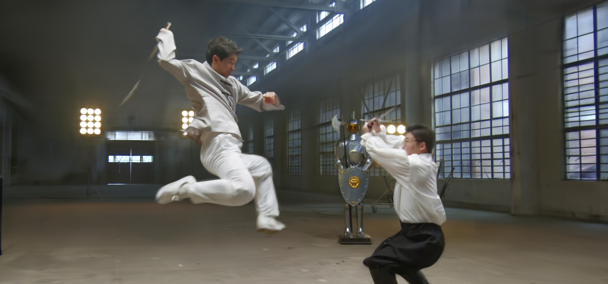
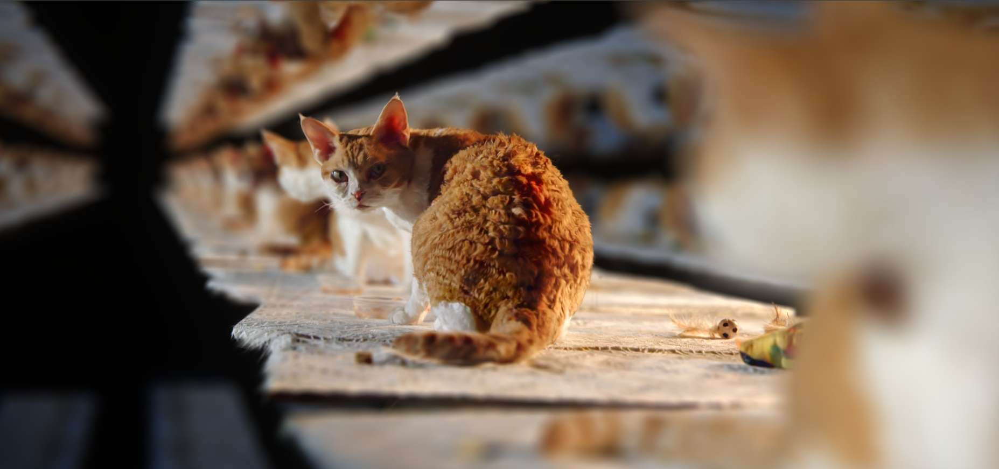
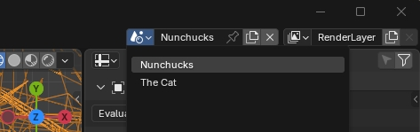
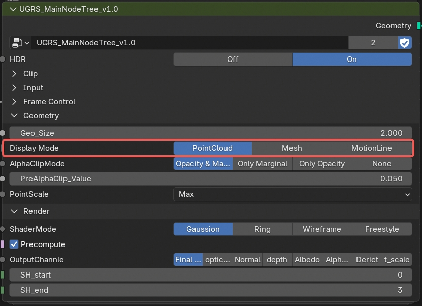

> **Note**
>
> This repository currently hosts temporary documentation and reference materials.

# Blender Real-time 4D Gaussian Splatting Demo

👉 [**Download the demo from Blender Demo Files**](https://www.blender.org/download/demo-files/#geometry-nodes)

This project runs on all Blender-supported platforms — Windows, macOS, Linux, and iPad.

It is released under the **CC-BY 4.0 License**. Proper attribution is required when reusing any part of this demo, especially node groups and shaders.

---

## Overview

This Blender project contains two preconfigured scenes demonstrating **real-time 4D Gaussian Splatting** in Blender using both **Eevee** and **Cycles**.

Open the `.blend` file in **Blender 5.0+**, switch to **Render View**, and play the timeline.

---

## Scenes

### Nunchucks (Eevee)

- Default scene when opening the file
- Real-time 4DGS bullet-time effect rendered entirely in Eevee

### The Cat (Cycles)

- Switch scene from the upper-right scene selector
- Enter Render View to experience ray-traced Gaussian rendering in an infinite mirror environment

---

## Implementation Notes

This implementation differs from standard Gaussian Splatting pipelines.

- Custom Gaussian transparency evaluation designed for Blender’s node system
- All transparency evaluated in 3D space (ray-dependent)
- A single node tree works in both Eevee and Cycles

**Recommended usage**
- Eevee: Point Cloud mode (best real-time performance)
- Cycles: Mesh mode inside the node group

---

## Underlying System

This demo is built on the **Universal Gaussian Rendering System (UGRS)**.

In collaboration with **4DV.ai**, UGRS was extended to support 4D Gaussian formats with compression and native slow-motion support.

Upcoming features:
- Relighting
- Proxy mesh rendering
- SOGS format integration

---

## Contributors

**Zhi Wang** — Graphics Pipeline TD, UGRS Core Developer  
📧 wangzhi310012@gmail.com  

**4DV.ai** — 4DGS technology development and capture  
📧 contact@4dv.ai  

---

## Links

- 🎬 RTL YouTube Replay  
- 🔗 SIGGRAPH 2025 RTL Showcase  

---

Released under the **Creative Commons Attribution (CC-BY 4.0)** License.
